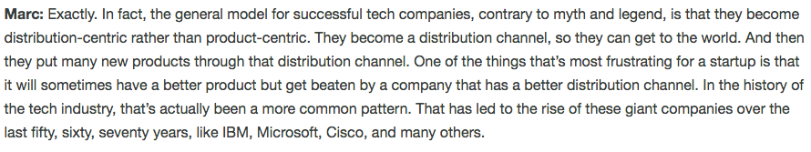

<!-- .slide: data-background="img/background-lightgreen-orig.jpg" -->

## Software Distribution Pipelines

---
<!-- .slide: data-background="img/background-lightgreen-orig.jpg" -->

### Definitions

   
  <b>Software Distribution:</b> 
  The process of delivering software to the end user

    
  <b>Software Distribution Pipeline:</b> 
  The processes supporting Software Distribution

---
<!-- .slide: data-background="img/background-lightgreen-orig.jpg" -->

### Why is this Important

  
  <small>https://a16z.com/2018/07/20/after-product-market-fit-marc-andreessen-elad-gil</small>

---
<!-- .slide: data-background="img/background-lightgreen-orig.jpg" -->

### Components of a SD Pipeline

