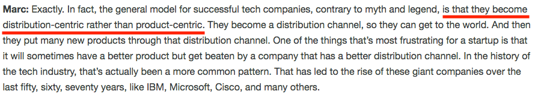

<!-- .slide: data-background="img/background-lightgreen-orig.jpg" -->

## Software Distribution Pipelines

---
<!-- .slide: data-background="img/background-lightgreen-orig.jpg" -->

### Definitions

   
  <b>Software Distribution:</b> 
  The process of delivering software to the end user

    
  <b>Software Distribution Pipeline:</b> 
  The processes supporting Software Distribution

---
<!-- .slide: data-background="img/background-lightgreen-orig.jpg" -->

### Why is this Important?

  
  <small>https://a16z.com/2018/07/20/after-product-market-fit-marc-andreessen-elad-gil</small>

---
<!-- .slide: data-background="img/background-lightgreen-orig.jpg" data-transition="slide-in none" -->

### SD Pipeline: Components

 <!-- .element: class="fragment" -->

---
<!-- .slide: data-background="img/background-lightgreen-orig.jpg" data-transition="none" -->

### SD Pipeline: Components

---
<!-- .slide: data-background="img/background-lightgreen-orig.jpg" data-transition="none" -->

### SD Pipeline: Components

---
<!-- .slide: data-background="img/background-lightgreen-orig.jpg" data-transition="none" -->

### SD Pipeline: Components

---
<!-- .slide: data-background="img/background-lightgreen-orig.jpg" data-transition="none" -->

### SD Pipeline: Components

---
<!-- .slide: data-background="img/background-lightgreen-orig.jpg" data-transition="none" -->

### SD Pipeline: Components

---
<!-- .slide: data-background="img/background-lightgreen-orig.jpg" -->

### SD Pipeline: Goals

 
Get a working end-to-end deployment ASAP

- Prove the pipeline works with a dummy product <!-- .element: class="fragment" -->
- Minimize the number of cooks in the kitchen   <!-- .element: class="fragment" -->
- Accept the product will never be perfect (it just has to provide value) <!-- .element: class="fragment" -->
- Create abstractions <!-- .element: class="fragment" -->
