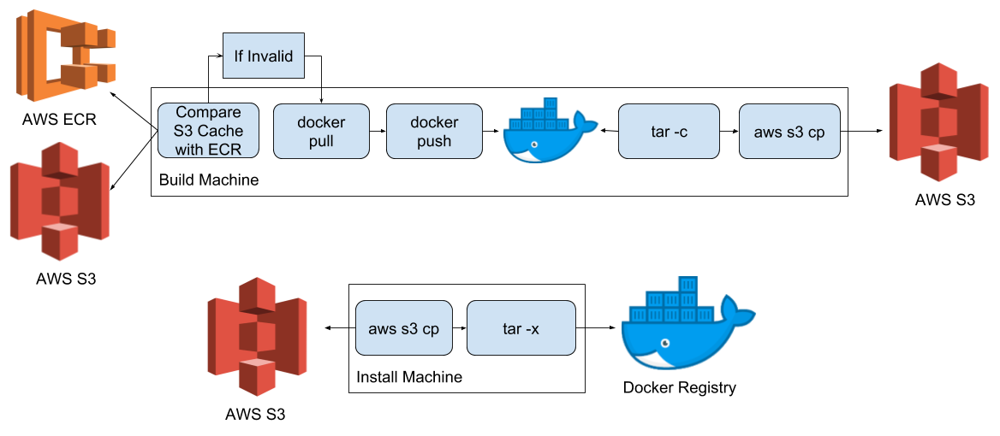

<!-- .slide: data-background="img/background-green-orig.jpg" -->

## Solution

  Instead of bundling Docker images, bundle the Docker registry
   

---
<!-- .slide: data-background="img/background-green-orig.jpg" -->

## Pipeline Improved

---
<!-- .slide: data-background="img/background-green-orig.jpg" -->

## Solution

This yielded quite an improvement on build and deploy times. However, during testing phases, this was still a bit painful. So..

 <em><b>Create a cache in S3 and only bundle if cache checksums don't match</b></em> <!-- .element: class="fragment" -->

---
<!-- .slide: data-background="img/background-green-orig.jpg" -->

## Pipeline Improved with Cache

---
<!-- .slide: data-background="img/background-green-orig.jpg" data-transition="slide-in none" -->

## Screenshot of Demo

<small>First Attempt: 3.2min for 2GB Image with 50MB/s Internet</small>

---
<!-- .slide: data-background="img/background-green-orig.jpg" data-transition="none" -->

## Screenshot of Demo

<small>Solution (No Cache): 2.8min for 2GB Image with 50MB/s Internet</small>

---
<!-- .slide: data-background="img/background-green-orig.jpg" data-transition="none" -->

## Screenshot of Demo

<small>Solution (Cache): 42s for 2GB Image with 50MB/s Internet</small>

---
<!-- .slide: data-background="img/background-green-orig.jpg" data-transition="none" -->

## Results

 

<table style="width:100%;border:2px solid;border-collapse:collapse;padding:2px;font-size:18px;">
  <tr>
    <th>Internet Speed (MB/s &uarr;&darr;)</th>
    <th>Image Size (GB)</th>
    <th>Images (#)</th>
    <th>Time First Attempt (m)</th>
    <th>Time No Cache (m)</th>
    <th>Time w/ Cache (m)</th>
    <th>Optimization (%)</th>
  </tr>
  <tr>
    <td>250</td>
    <td>2</td>
    <td>10</td>
    <td>15</td>
    <td>14</td>
    <td>2</td>
    <td>86%</td>
  </tr>
  <tr>
    <td>100</td>
    <td>2</td>
    <td>10</td>
    <td>22</td>
    <td>19</td>
    <td>4</td>
    <td>81%</td>
  </tr>
  <tr>
    <td>50</td>
    <td>2</td>
    <td>10</td>
    <td>32</td>
    <td>28</td>
    <td>7</td>
    <td>78%</td>
  </tr>
  <tr>
    <td>20</td>
    <td>2</td>
    <td>10</td>
    <td>62</td>
    <td>53</td>
    <td>17</td>
    <td>73%</td>
  </tr>
  <tr>
    <td>5</td>
    <td>2</td>
    <td>10</td>
    <td>212</td>
    <td>179</td>
    <td>67</td>
    <td>68%</td>
  </tr>
  <tr>
    <td>1</td>
    <td>2</td>
    <td>10</td>
    <td>1011</td>
    <td>854</td>
    <td>334</td>
    <td>67%</td>
  </tr>
</table>

(These times assume &#x221e; disk IO)

