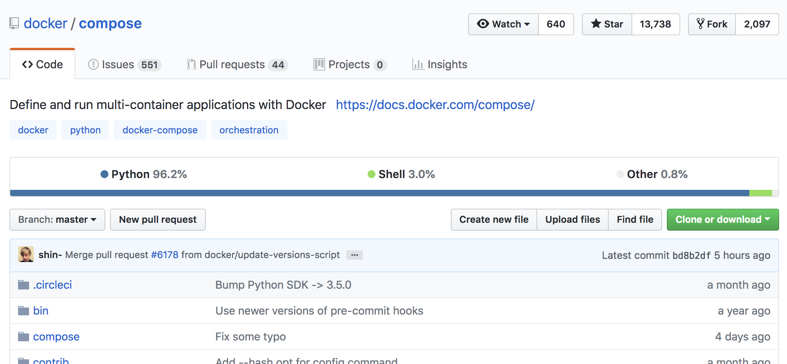
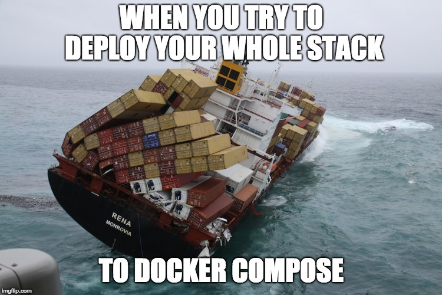

<!-- .slide: data-background="img/background-green-orig.jpg" -->

## Docker Compose

---
<!-- .slide: data-background="img/background-green-orig.jpg" -->

### What is Docker Compose?

Docker Compose lets your organize and manage a collection of Docker Containers on your machine   <!-- .element: class="fragment" -->
   <!-- .element: class="fragment" -->

---
<!-- .slide: data-background="img/background-green-orig.jpg" -->

### Why is this Important?

  Easy for developers to write, share and test docker systems 
  

---
<!-- .slide: data-background="img/background-green-orig.jpg" -->

### What does this look like?

    version: '3'
    services:
      dummy-golang-project:
        environment:
          KEY1: val1
          KEY2: val2
        image: rms1000watt/dummy-golang-project
        ports:
          - 9999:9999
        volumes:
          - /tmp:/tmp

---
<!-- .slide: data-background="img/background-green-orig.jpg" -->

### Demo

    docker-compose up

---
<!-- .slide: data-background="img/background-green-orig.jpg" -->

### Docker Compose

The only catch is.. Docker Compose only runs locally
 <!-- .element: class="fragment" -->
