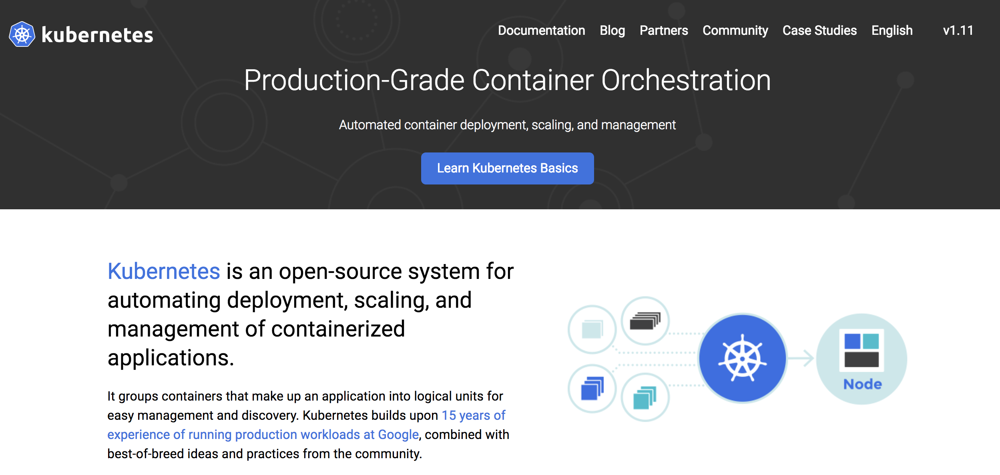
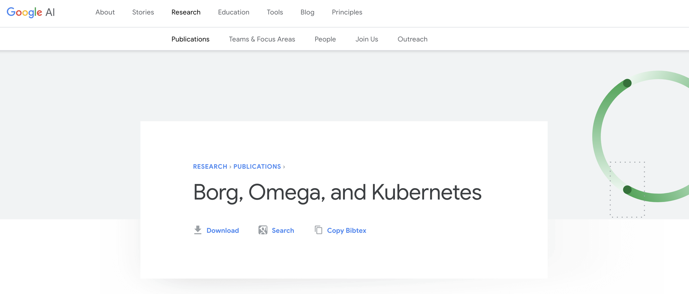
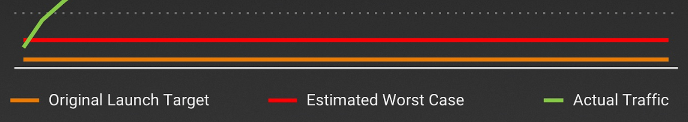
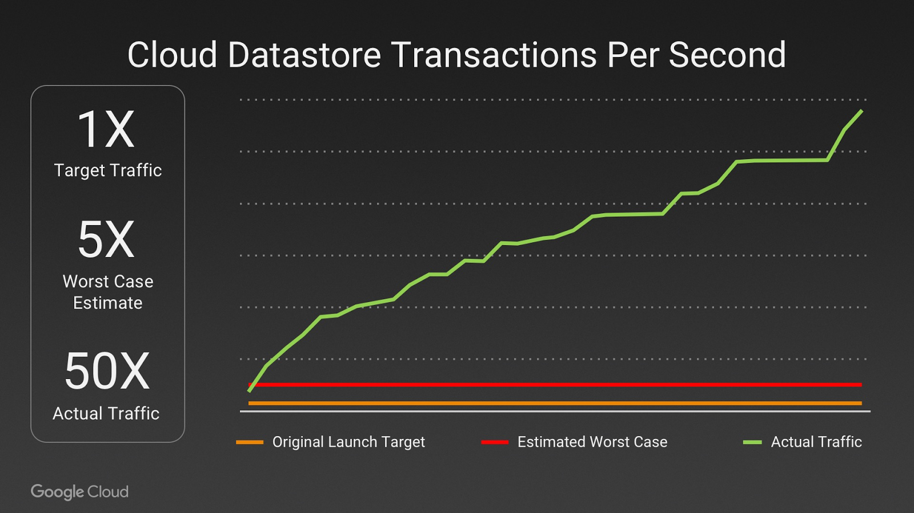
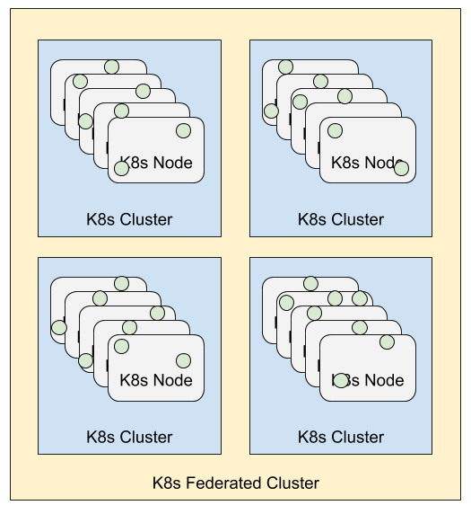
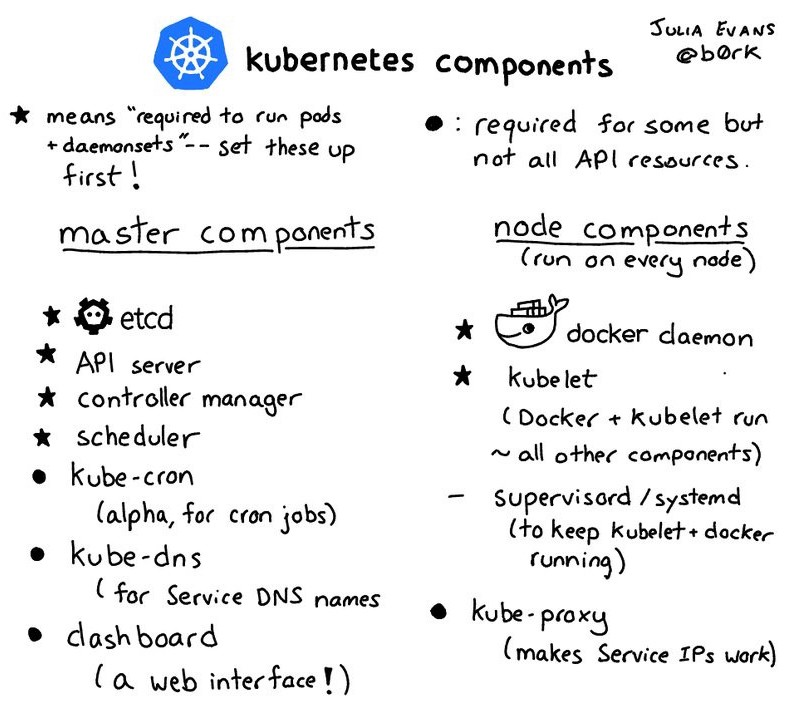
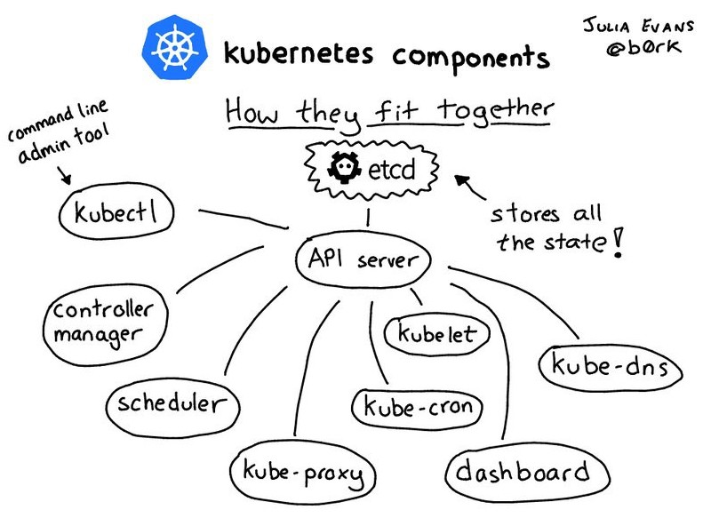
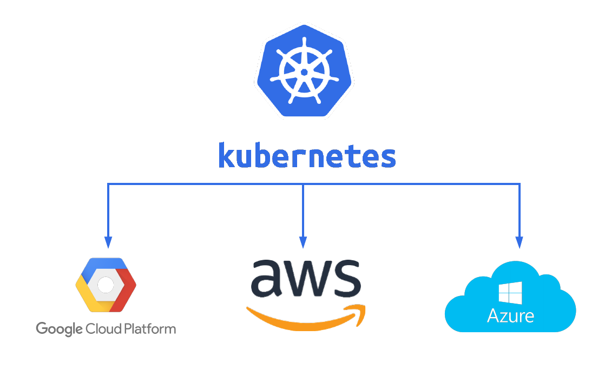
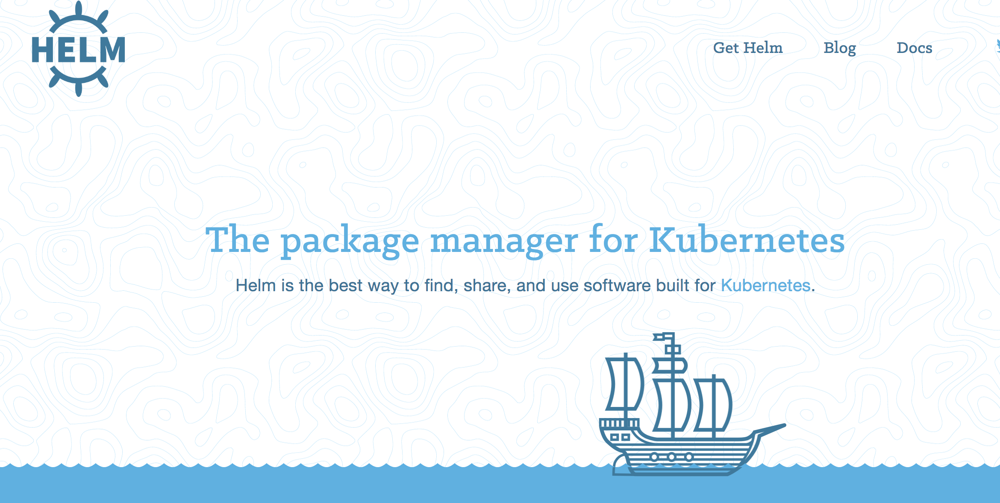
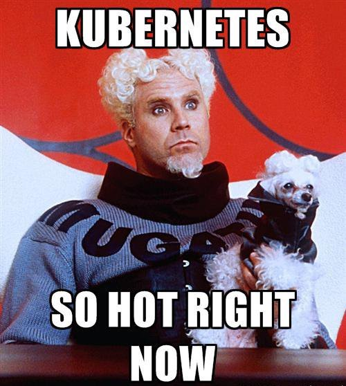

<!-- .slide: data-background="img/background-orange-orig.jpg" -->

## Kubernetes

---
<!-- .slide: data-background="img/background-orange-orig.jpg" -->

### What is Kubernetes?

  

---
<!-- .slide: data-background="img/background-orange-orig.jpg" -->

### Kubernetes Origin

  Kubernetes was birthed at Google as the third iteration of their container management systems 
  
  <small>https://ai.google/research/pubs/pub44843</small>

---
<!-- .slide: data-background="img/background-orange-orig.jpg" -->

### Who uses Kubernetes?

  

---
<!-- .slide: data-background="img/background-orange-orig.jpg" -->

### Pokémon Go

 <!-- .element: class="fragment" -->

---
<!-- .slide: data-background="img/background-orange-orig.jpg" -->

### Pokémon Go

<small>https://cloudplatform.googleblog.com/2016/09/bringing-Pokemon-GO-to-life-on-Google-Cloud.html</small>

---
<!-- .slide: data-background="img/background-orange-orig.jpg" -->

### Kubernetes System

 <!-- .element: class="fragment" -->

---
<!-- .slide: data-background="img/background-orange-orig.jpg" -->

### Kubernetes Components

 <!-- .element: class="fragment" -->

---
<!-- .slide: data-background="img/background-orange-orig.jpg" -->

### Kubernetes Components

 <!-- .element: class="fragment" -->

---
<!-- .slide: data-background="img/background-orange-orig.jpg" -->

### Running Kubernetes in the Cloud

 <!-- .element: class="fragment" -->

---
<!-- .slide: data-background="img/background-orange-orig.jpg" -->

### Running Kubernetes Locally

  Just install Docker for Windows/OS X
  

---
<!-- .slide: data-background="img/background-orange-orig.jpg" -->

### Kubernetes Configuration

    apiVersion: apps/v1
    kind: Deployment
    metadata:
      name: test-echo
    spec:
      selector:
        matchLabels:
          app: test-echo
      replicas: 2
      template:
        metadata:
          labels:
            app: test-echo
        spec:
          containers:
          - name: test-echo
            image: rms1000watt/dummy-golang-project
    --
    apiVersion: v1
    kind: Service
    metadata:
      name: test-echo
    spec:
      type: LoadBalancer
      ports:
      - port: 9999
        targetPort: 9999
        protocol: TCP
      selector:
        app: test-echo

---
<!-- .slide: data-background="img/background-orange-orig.jpg" -->

### Demo

    kubectl apply -f hello-world.yml

---
<!-- .slide: data-background="img/background-orange-orig.jpg" -->

### Helm

  Package manager for Kubernetes
  

---
<!-- .slide: data-background="img/background-orange-orig.jpg" -->

### Demo

    helm install stable/tensorflow-notebook

---
<!-- .slide: data-background="img/background-orange-orig.jpg" -->

### Demo

    helm install rms1000watt/monochart -f values.yml

`values.yml`

    image:
      repository: rms1000watt/dummy-golang-project

    deployment:
      enabled: true

    service:
      enabled: true
      internalPort: 9999
      externalPort: 9999

---
<!-- .slide: data-background="img/background-orange-orig.jpg" -->

### Kubernetes

  Extremely popular and battle-tested, distributed system for deploying containers  
  

