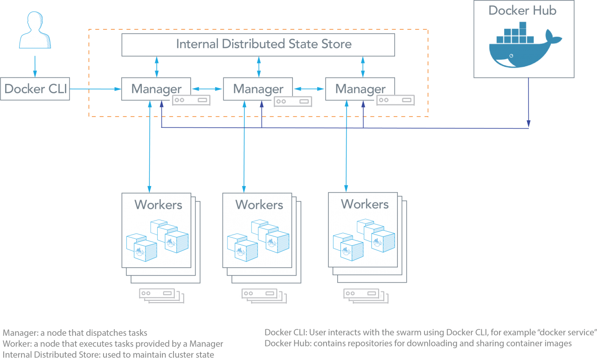
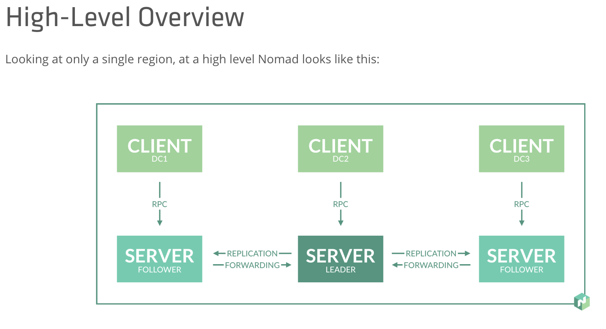

<!-- .slide: data-background="img/background-violet-orig.jpg" -->

## Other Orchestrators

---
<!-- .slide: data-background="img/background-violet-orig.jpg" -->

### Docker Swarm

  Distributed Docker container orchestrator built by the Docker team 
  

---
<!-- .slide: data-background="img/background-violet-orig.jpg" -->

### Docker Swarm

- &#x1f604; Easy to use (smaller learning curve)                         <!-- .element: class="fragment" -->
- &#x1f604; Enterprise support                                           <!-- .element: class="fragment" -->
- &#x1f604; Cloud managed offerings                                      <!-- .element: class="fragment" -->
- &#x1f914; OK community support                                         <!-- .element: class="fragment" -->
- &#x1f914; Don't see articles, blogs, videos about massive deployments  <!-- .element: class="fragment" -->

---
<!-- .slide: data-background="img/background-violet-orig.jpg" -->

### Nomad

  Distributed orchestrator built by Hashicorp 
  

---
<!-- .slide: data-background="img/background-violet-orig.jpg" -->

### Nomad

- &#x1f604; Million container challenge (1,000,000 containers on 5000 hosts in 5 minutes) <!-- .element: class="fragment" -->
- &#x1f604; Easy to install (single binary)      <!-- .element: class="fragment" -->
- &#x1f604; Fairly easy to use                   <!-- .element: class="fragment" -->
- &#x1f604; Can run more than just Docker images <!-- .element: class="fragment" -->
- &#x1f604; Enterprise support                   <!-- .element: class="fragment" -->
- &#x1f914; OK community support                 <!-- .element: class="fragment" -->
- &#x1f914; No cloud managed offerings           <!-- .element: class="fragment" -->

