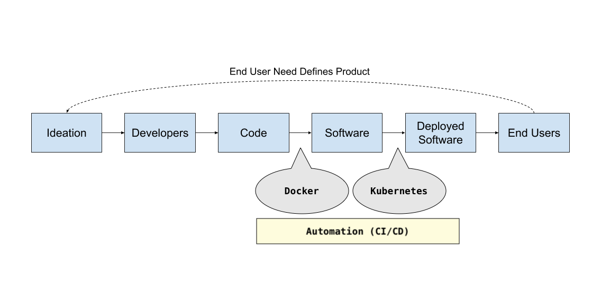

<!-- .slide: data-background="img/background-title-orig.jpg" -->

## Summary

---
<!-- .slide: data-background="img/background-title-orig.jpg" -->

### Software Distribution Pipelines

  Here's how Docker + Kubernetes fits in to the Software Distribution Pipeline 
  

---
<!-- .slide: data-background="img/background-title-orig.jpg" -->

### Recommendations

- &#x1f433; Dockerize all immutable servers            <!-- .element: class="fragment" -->
- &#x1f300; Use cloud hosted Kubernetes                <!-- .element: class="fragment" -->
- &#x1f4be; Use cloud hosted Databases                 <!-- .element: class="fragment" -->
- &#x1f6e0; Use automation to build and deploy (CI/CD) <!-- .element: class="fragment" -->
- &#x1f92a; Don't believe the fear of "Cloud Lock-in"  <!-- .element: class="fragment" -->
- &#x1f512; If need be, move to more regulated cloud   <!-- .element: class="fragment" -->
- &#x1f5a5; Worst case, migrate Kubernetes to On-Prem  <!-- .element: class="fragment" -->
