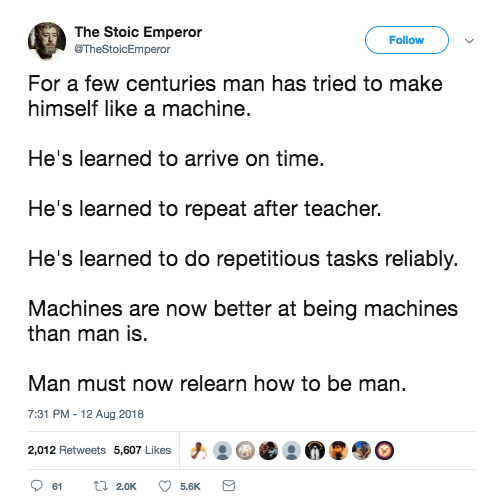
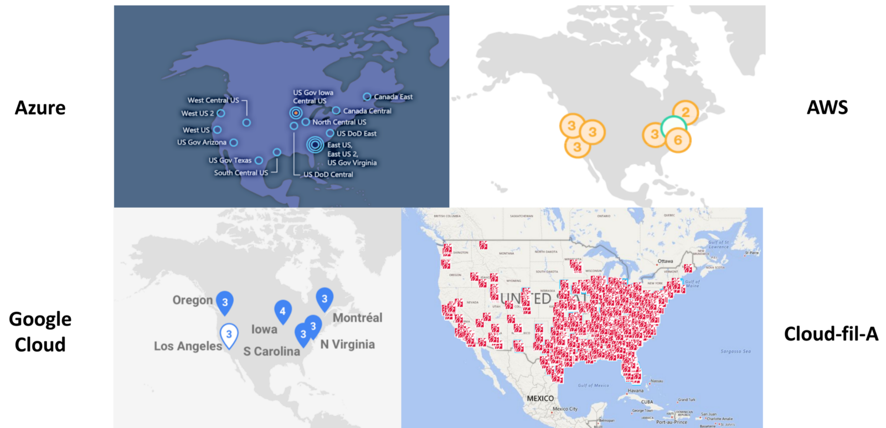
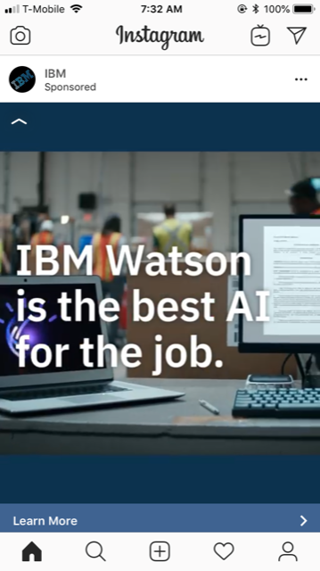
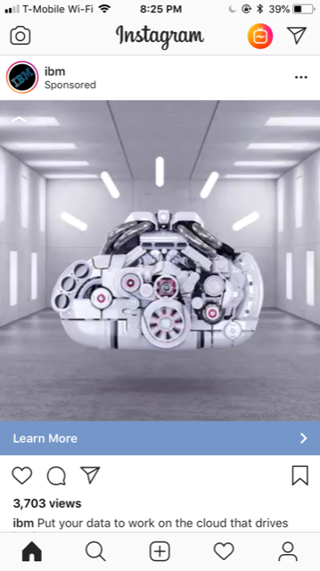
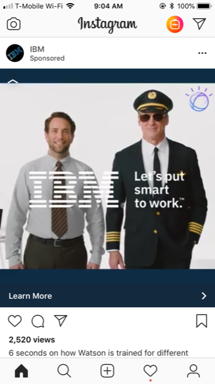

<!-- .slide: data-background="img/background-green-orig.jpg" -->

## Ending Notes

---
<!-- .slide: data-background="img/background-green-orig.jpg" -->

### Relearn How to be Man

<small> https://twitter.com/TheStoicEmperor/status/1028831254119161856 </small>

---
<!-- .slide: data-background="img/background-green-orig.jpg" -->

### Chick fil A

  Chick fil A has "Edge Processing" in their restaurants each with a Kubernetes cluster 
   
  <small>https://medium.com/@cfatechblog/edge-computing-at-chick-fil-a-7d67242675e2</small>

---
<!-- .slide: data-background="img/background-green-orig.jpg" -->

### IBM Ads

  IBM Watson ads spam me on Instagram 
  
  
  
  
  

